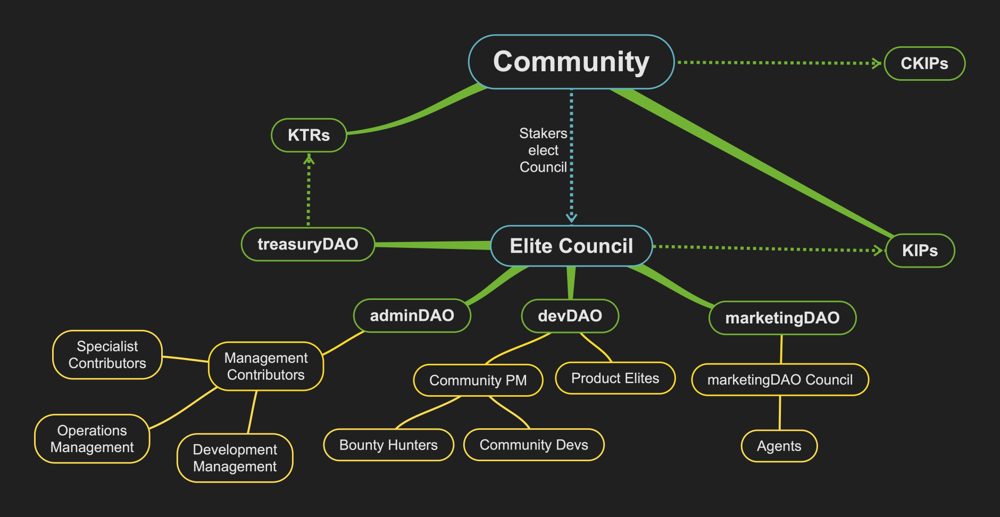

# Governance Framework

Kwenta requires a governance framework that enables the community to coordinate on maintaining and improving the protocol. To do this, the Elite Council will vote on a system, outlined in this proposal, that will dictate roles and processes that the Kwenta community will use to operate.

By having a clear framework in which Kwenta governance will operate, the community will have the faculties it needs to achieve desired outcomes such as a defined way to propose new features, rewards DAO participants, and manage routine affairs.


Further reading: [KIP-2: Kwenta Governance Framework](https://kips.kwenta.io/kips/kip-2/)


## DAO Structure

Kwenta governance will follow a democratic structure with multiple semi-independent governing bodies, each with its own goals and operational structure.

To learn about the various roles in the Kwenta DAO, visit the [DAO Roles](dao-roles/) section.

## Kwenta Improvement Proposals (KIP)

A Kwenta Improvement Proposal (KIP) outlines a change to be made to the Kwenta protocol. These are submitted to the Elite Council for voting and require a majority to pass.

Here is an example of the process a KIP would follow to be implemented:

1. A community member would write a KIP for a change to be made to Kwenta, following the structure established in [KIP-01](https://kips.kwenta.io/kips/kip-1/).
2. If there is community support (Ex. recurring discussion in discord about the KIP) or Core Contributor support is demonstrated for the KIP, the Elite Council would vote on the KIP.
3. If a majority is reached, the KIP will be handed over to the Core Contributors for implementation. If the KIP fails, it is properly labeled and dropped from the KIP process.
4. If designs are required, the core contributors will create designs and present them to the Product Elites.
5. Once Product Elite feedback has been taken into account and implemented into designs as necessary, the Product Elites will be responsible for approving the designs. The amount of approvals required for designs to pass this stage will be determined by the Elite Council
6. Once designs are approved, Core Contributors will then write the code necessary to implement the designs. If designs are not needed, the CCs would write the code necessary to meet the KIP’s requirements.
7. Once the necessary code has been written, the code would be staged for Product Elites to test. Testing feedback would be implemented as needed.
8. If the Product Elites determine that the code meets their standards and the required amount of approvals have been met, the code would be pushed to production.

## Community Kwenta Improvement Proposals (CKIP)

In the event that a structural change needs to be made to the DAO’s governance system, the community can overrule the Elite Council by reaching a quorum (over 50% of circulating supply voting in favour of a proposal) with a Community Kwenta Improvement Proposal (CKIP). CKIPs should only be used in the event that there’s a disagreement between the Elite Council and the Kwenta community.

## Kwenta Treasury Request (KTR)

In the event that funding is required from the treasuryDAO, community members can create a KTR which will be passed to the treasuryDAO and either approved or rejected.

## Removal Mechanism

In the event that the community feels a member of the DAO is acting maliciously, a KIP can be written to remove a member of the DAO. This KIP would be voted on by the Elite Council and would require a majority to pass. If a council member is removed, the seat will remain empty for the remainder of the epoch.

## DAO Role Compensation

DAO roles will be compensated via a portion of the yield generated by the growth fund. This will eventually be fulfilled by the treasury however due to the high inflation rate, the treasury will remain staked and untouched until a later date to ensure it still accumulates and retains a meaningful amount of the token supply. Compensation is determined by the Elite Council.

## Implementation

[Token-managed governance](../tokenomics/kwenta-tokenomics.md) will go into effect once the Kwenta token is live. Until the Kwenta token is live, the Interim Kwenta Council will act as the official governing body. The first token-managed election will be held at the start of the next quarter following the Kwenta token launch.
