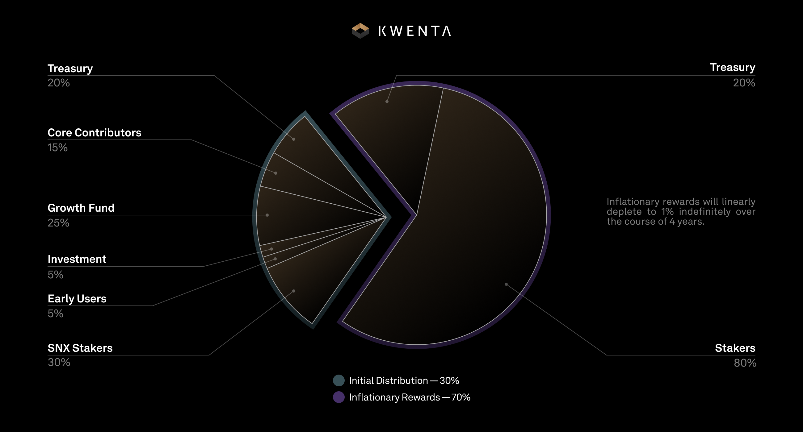

# Kwenta Tokenomics

The Kwenta token (KWENTA) will be used to incentivize coordination and growth within the Kwenta DAO. It will have two primary functions: (a) **Staking** and (b) **Governance**.


Further reading: [KIP-4: Kwenta Tokenomics](https://kips.kwenta.io/kips/kip-4/)


## Supply

KWENTA will have an initial **supply of 313,373.** Inflationary rewards will start at 60% APY in KWENTA and linearly deplete to 1% indefinitely over the course of 4 years. This will result in a total supply of 1,062,486.81 KWENTA at the end of 4 years. and will be distributed as follows:

.png>)

* 30% - Synthetix Stakers
* 5% - synthetix.exchange and early Kwenta Traders
* 5% - Investment
* 25% - Community Growth Fund
* 15% - Core Contributors
* 20% - Kwenta Treasury

## Inflation and Fee Allocation:

20% of inflation and fees will be routed to the treasury. 80% of inflation and fees will be routed to stakers. These percentages can be adjusted at the Elite Council's discretion via a KIP. This will enable Kwenta to sustainably fund DAO roles while enabling the community to use the entire token supply as needed.

## Vesting Mechanism

KWENTA printed via inflation will undergo a 1-year lock-up period. The lock-up mechanism will begin with an 80% fee for vesting KWENTA early which will decay linearly. If tokens are vested early, the percentage of tokens that are still applicable to the fee will be burned. After one year, the fee would reach 0% and no tokens would be burned when vesting KWENTA.

## Distribution

* Synthetix stakers - SNX stakers who have met the requirements (TBD) will be allocated 30% of the initial token supply.
* Synth Traders - Addresses that have used Kwenta and meet the requirements (TBD) will be allocated 5% of the initial token supply.

The remaining KWENTA will be allocated to the treasury for further management.
